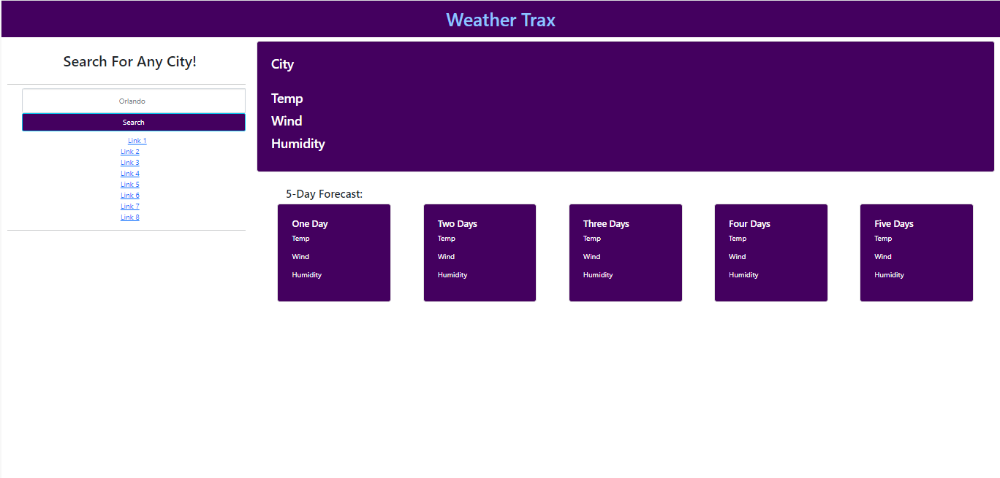

# Work n' Flow: A Calendar App For Work Days

## Description

For the Sixth Module Challenge in my coding boot camp, I was tasked with building an interactive website that allows the user to search and plan ahead for weather patterns in different cities.

The Acceptance Criteria is as follows:

GIVEN a weather dashboard with form inputs
WHEN I search for a city
THEN I am presented with current and future conditions for that city and that city is added to the search history
WHEN I view current weather conditions for that city
THEN I am presented with the city name, the date, an icon representation of weather conditions, the temperature, the humidity, and the the wind speed
WHEN I view future weather conditions for that city
THEN I am presented with a 5-day forecast that displays the date, an icon representation of weather conditions, the temperature, the wind speed, and the humidity
WHEN I click on a city in the search history
THEN I am again presented with current and future conditions for that city

## Usage

When the user loads the page, they will see an example of a search, Orlando, and it will use the Weather API to fetch and present the current weather data as well as its 5 day forecast. As the user searches for different cities, the cities that they search for will be stored and each city will be appended to the page as a link below the search input. For convenience, the user can then easily go back to previous searches.

## Screenshot

## Credits

N/A

## License

N/A